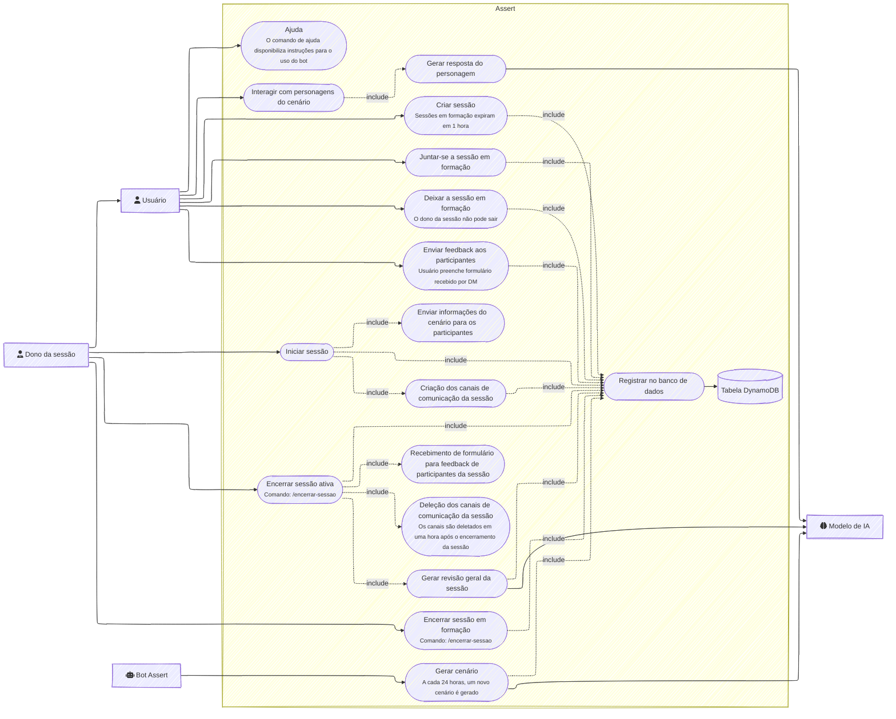

# Assert

Um bot de Discord para simulações de equipes de TI em cenários corporativos
intensos, focado em desenvolver habilidades de comunicação assertiva.

## Índice

- [Visão Geral](#visão-geral)
- [Funcionalidades](#funcionalidades)
- [Comandos Disponíveis](#comandos-disponíveis)
- [Configuração](#configuração)
  - [Variáveis de Ambiente](#variáveis-de-ambiente)
  - [Infraestrutura](#infraestrutura)
- [Instalação e Uso](#instalação-e-uso)
  - [Pré-requisitos](#pré-requisitos)
  - [Instalação Local](#instalação-local)
  - [Deploy em Produção](#deploy-em-produção)
- [Estrutura do Projeto](#estrutura-do-projeto)
- [Desenvolvimento](#desenvolvimento)
- [Diagramas](#diagramas)
- [Licença](#licença)

## Visão Geral

O Assert é um bot de Discord projetado para criar experiências de roleplay
corporativo realistas para equipes de TI. Através de cenários intensos que
envolvem dilemas éticos e pressões corporativas, os participantes desenvolvem
habilidades de comunicação assertiva e tomada de decisão sob pressão.

## Funcionalidades

- **Criação de Sessões**: Forme grupos de até 4 participantes para sessões de
  roleplay
- **Geração de Cenários**: Cenários realistas com dilemas éticos e pressões
  corporativas usando IA
- **Canais Privados**: Criação automática de canais de texto e voz para as
  sessões
- **Respostas de NPCs**: NPCs que respondem a menções nos canais de sessão
- **Sistema de Feedback**: Coleta de feedback anônimo após o término das sessões
- **Avaliações Automáticas**: Análise automática do desempenho dos participantes
  usando IA

## Comandos Disponíveis

### /criar-sessao

Inicia a formação de uma nova sessão. O comando cria uma mensagem com botões
onde outros usuários podem se juntar.

### /iniciar-sessao

Inicia a sessão com os participantes atuais, criando canais privados e
distribuindo personagens.

### /encerrar-sessao

Encerra uma sessão ativa ou em formação da qual você é dono.

## Configuração

### Variáveis de Ambiente

| Variável                | Descrição                                             |
| ----------------------- | ----------------------------------------------------- |
| `BOT_TOKEN`             | Token do bot do Discord                               |
| `BOT_CLIENT_ID`         | ID do cliente do bot                                  |
| `OPENROUTER_API_KEY`    | Chave API do OpenRouter para geração de cenários      |
| `MAIN_CHANNEL_ID`       | ID do canal principal onde os comandos são executados |
| `AWS_ACCESS_KEY_ID`     | Chave de acesso AWS para DynamoDB                     |
| `AWS_SECRET_ACCESS_KEY` | Chave secreta AWS para DynamoDB                       |
| `AWS_REGION`            | Região AWS (ex: us-east-2)                            |

### Infraestrutura

O projeto utiliza:

- **DynamoDB**: Para armazenamento de dados de sessões, participantes e cenários
- **Terraform**: Para provisionamento da infraestrutura AWS
- **OpenRouter**: Para geração de cenários via IA
- **EC2**: Para hospedagem do bot em produção
- **CloudWatch**: Para monitoramento e logging

## Instalação e Uso

### Pré-requisitos

- Deno >= 2.0
- Conta AWS com permissões para DynamoDB e EC2
- Conta OpenRouter para geração de cenários com IA
- Bot de Discord configurado no Developer Portal

### Instalação Local

1. Clone o repositório:

```bash
git clone <url-do-repositorio>
cd assert-bot
```

2. Configure as variáveis de ambiente no arquivo `.env`:

```bash
touch .env
# Edite o arquivo .env com suas configurações
```

3. Instale as dependências:

```bash
deno cache src/index.ts
```

4. Execute o bot:

```bash
deno task start
```

### Deploy em Produção

1. Configure as chaves SSH e variáveis de ambiente necessárias
2. Execute o script de deploy:

```bash
chmod +x deploy.sh
./deploy.sh
```

O script irá:

- Validar e compilar o código
- Aplicar a configuração Terraform
- Implantar o binário na instância EC2
- Configurar o CloudWatch Agent

## Estrutura do Projeto

```
src/
├── commands/          # comandos do bot
├─────────── */
├────────────── index.ts    # definição principal do comando
├── lib/              # utilitários e funções auxiliares
├── middleware/       # middlewares do bot
├── schemas/         # esquemas de validação Zod
├── table/           # modelos de dados do DynamoDB
└── index.ts         # ponto de entrada principal
```

## Desenvolvimento

### Adicionando Novos Comandos

1. Crie uma nova pasta em `src/commands/` com o nome do comando
2. Implemente o comando seguindo a interface `BotCommand`
3. Exporte o comando como default no `index.ts`
4. O middleware `loadCommands` irá registrar automaticamente o comando quando o
   bot iniciar

### Geração de Cenários

Os cenários são gerados automaticamente a cada 24 horas usando a API do
OpenRouter. A lógica de geração está em `src/lib/generateScenario.ts`.

### Banco de Dados

Os modelos de dados são definidos usando DynamoDB OneTable em
`src/table/models.ts`. A configuração do Terraform para a tabela está em
`infra.tf`.

## Diagramas

Os diagramas são definidos como código utilizando
[mermaid](https://mermaid.js.org/).

### Diagrama de Caso de Uso



### Diagrama de Classes


## Licença

Este projeto está sob a licença CC-BY-NC-ND-4.0. Veja o arquivo LICENSE.md para
detalhes.
